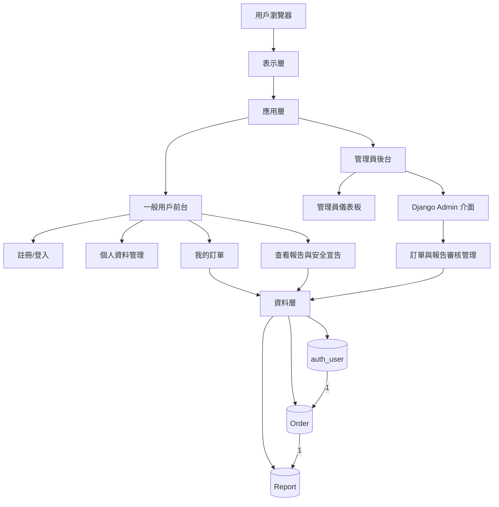
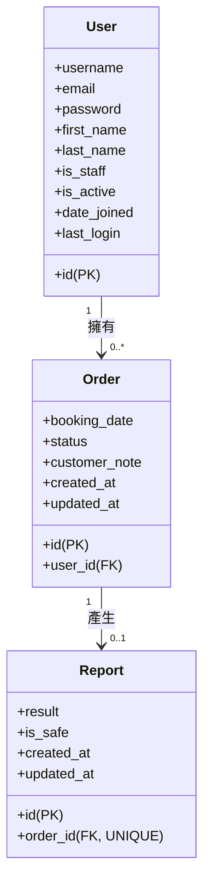
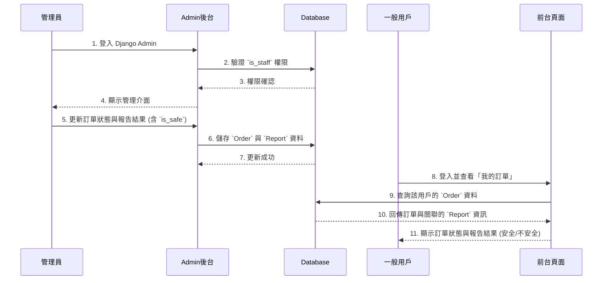
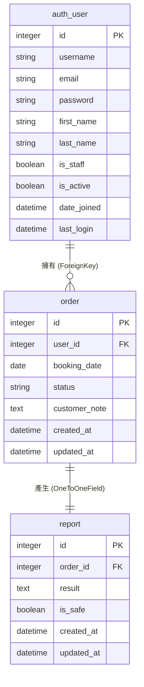

# Python 網站框架開發助理證書 — 網站開發專案報告（優化版）

**主題**：香港驗窗及鋁窗維修承建商一站式網站（Django）  
**班別**：CT290DS009  
**學員姓名**：黃國裕 (17)、郭慶偉 (21)、李婵娟 (07)、Yung Ching Wei (22)  
**日期**：2026 年 6 月

---

## 📑 目錄

1. [專案主題介紹](#一專案主題介紹)
2. [網站整體架構設計（UML）](#二網站整體架構設計uml)
3. [網站頁面結構與功能說明](#三網站頁面結構與功能說明)
4. [核心功能截圖備註](#四核心功能截圖備註)
5. [Django 後端模型設計（UML 類圖）](#五django-後端模型設計uml-類圖)
6. [開發困難與解決方案](#六開發困難與解決方案)
7. [總結](#七總結)

---

## 一、專案主題介紹

### 1.1 開發目的

本專案以香港屋宇署強制驗窗法例為基礎，開發一站式的驗窗與鋁窗維修承建商網站。網站使用 Django 框架，實現**從預約、檢驗、維修到報告生成與提交**的完整數位化服務流程，滿足真實香港商業場景與課程要求。

### 1.2 開發動機

1. 香港舊樓眾多，強制驗窗需求龐大，市場急需透明、可靠的數位服務平台。
2. 業主需要一個能**線上預約、追蹤訂單、查看官方報告**的整合式入口。
3. 承建商需要**高效的訂單管理、報告生成與客戶溝通工具**。
4. 旨在練習 Django 的**用戶認證系統 (`auth_user`)、資料庫關聯設計、後台管理與響應式前端開發**。

### 1.3 核心價值

1. **法規合規**：嚴格遵循香港《建築物條例》第 123 章的強制驗窗法定流程。
2. **用戶賦能**：一般用戶可線上預約、查看歷史訂單、更新個人備註，並獲取官方的「**維修是否安全 (`is_safe`)**」報告宣告。
3. **管理高效**：管理員 (`is_staff`) 可透過專屬**側邊欄**快速進入 **Django Admin** 後台，進行訂單審核、報告編輯與狀態更新。
4. **全端整合**：實現從前台預約到後台管理的完整數據流，並採用響應式設計，確保手機、電腦與平板皆可流暢使用。

---

## 二、網站整體架構設計（UML）

### 2.1 系統三層架構圖

下圖展示了系統的整體分層設計與資料流向。架構清晰地分為**表示層**、**應用層**與**資料層**。在應用層中，系統根據用戶權限（`is_staff`）將其分流至「一般用戶前台」或「管理員後台」，實現功能隔離與權責劃分。資料層則聚焦於 `auth_user`、`Order` 與 `Report` 三個核心模型，它們構成了本網站主要業務邏輯的數據基礎。



### 2.2 用戶前台與管理後台分流流程圖

此圖說明了用戶登入後，系統如何根據 `is_staff` 權限將其分流至不同的操作界面，凸顯了 Django 認證系統的核心作用。

```mermaid
graph TD
    A[訪客] --> B[註冊 / 登入];
    B --> C{身份驗證與權限檢查};
    C -->|一般用戶 (is_staff=False)| D[會員前台];
    C -->|管理員 (is_staff=True)| E[管理後台];
    D --> D1[個人資料管理]
    D1 --> D2[我的訂單]
    D2 --> D3[更新客戶備註]
    D2 --> D4[查看報告]
    D4 --> D5[檢視「維修是否安全」宣告]
    E --> E1[管理員儀表板]
    E1 --> E2[通過側邊欄進入 Django Admin]
    E2 --> E3[訂單狀態審核與更新]
    E2 --> E4[編輯報告結果與安全宣告]
```

### 2.3 核心靜態模型圖（精簡版 Class Diagram）

此圖聚焦於本專案的三個核心數據模型：`auth_user` (Django內建)、`Order` (訂單) 與 `Report` (報告)。`OrderItem`, `ProductBOM`, `ProductMaster` 等屬於後台資料匯入與管理用途的模型，不納入前台核心用戶流程。



### 2.4 核心功能序列圖：管理員更新報告 → 用戶查看結果

此序列圖生動地展示了管理員透過後台更新報告，以及一般用戶在前台查看更新結果的完整數據流。



---

## 三、網站頁面結構與功能說明

本網站共包含 13 個主要頁面，並整合了強大的後台管理系統。核心頁面功能如下：

| 頁面分類 | 頁面名稱 | 主要功能描述 |
|---|---|---|
| **資訊與行銷** | 首頁、關於我們、服務項目、強制驗窗、價目表、工程案例 (含太古城/黃埔花園/麗港城)、知識庫、聯絡我們 | 展示公司專業形象、服務範圍、法定流程、透明報價與成功案例，建立用戶信任。 |
| **用戶服務** | 會員註冊及登錄 | 提供用戶註冊、登入、登出及**個人資料管理**功能。 |
| **用戶個人化** | **我的訂單** | 用戶登入後可查看歷史訂單列表，並能針對特定訂單**更新客戶備註 (`customer_note`)**。 |
| **用戶查詢** | **報告查詢** | 訂單完成後，用戶可在此查看最終的檢驗報告結果，內容包含**「維修是否安全 (`is_safe`)」**的明確宣告。 |
| **後台管理** | 管理員儀表板、Django Admin 介面 | 管理員 (`is_staff`) 可通過側邊欄快速進入 Django Admin，進行**訂單審核、狀態修改、報告編輯與文件管理**。 |

---

## 四、核心功能截圖備註

- **4.1 首頁**：顯示響應式 Banner、公司優勢及清晰的服務導航入口。
- **4.2 - 4.12 (關於我們至聯絡我們頁)**：展示公司資訊、服務項目、法定流程、價格、案例、知識庫及聯絡方式，建立專業形象。
- **4.13 會員註冊頁**：整合 Django `auth_user` 系統，實現新用戶註冊與資料驗證。
- **4.14 後台登入與管理介面**：展示管理員 (`is_staff`) 通過側邊欄進入 Django Admin 的流程，並展示訂單管理與報告編輯功能。
- **4.15 - 4.16 (後台管理)**：重點展示管理員在 Django Admin 中對 `Order` 與 `Report` 模型進行審核、狀態更新與報告產生的操作畫面。

---

## 五、Django 後端模型設計（UML 類圖）

### 5.1 核心模型關係圖

本專案的資料庫設計以 Django 內建的 `auth_user` 模型為基礎，向外延伸出 `Order` 與 `Report` 兩個核心業務模型。`Order` 透過 `ForeignKey` 與 `User` 關聯，`Report` 則透過 `OneToOneField` 與 `Order` 關聯。



> **備註說明**：`OrderItem`, `ProductBOM`, `ProductMaster` 等模型屬於後台管理與資料匯入用途，不直接服務於前台用戶的核心流程，因此未納入此核心類圖中。

---

## 六、開發困難與解決方案

| 問題 | 解決方案 |
|---|---|
| **1. 不熟悉香港驗窗法例流程** | 參考屋宇署官網與本地承建商網站，嚴格按法定流程設計頁面與業務邏輯。 |
| **2. Django 模型關係設計複雜** | 先繪製 **UML 類圖**釐清核心模型 (`User`, `Order`, `Report`) 關係，再逐步編寫模型與 CRUD 功能。 |
| **3. 響應式界面排版混亂** | 使用 **Bootstrap 5** 框架，確保電腦、手機與平板皆可正常顯示與操作。 |
| **4. 報告上傳與下載功能實現** | 使用 Django `FileField`，正確配置媒體檔案路徑，並由**管理員 (`is_staff`) 透過 Django Admin** 進行報告的上傳與更新。 |
| **5. 後台權限控制** | 使用 Django 內建的 **`is_staff` 權限系統**，區分一般用戶與管理員。管理員可透過**側邊欄**快速進入 `Django Admin`，而一般用戶僅能訪問前台個人化頁面（如「我的訂單」與「報告查詢」）。 |

---

## 七、總結

本專案成功使用 Django 框架開發了一個符合香港法例的驗窗維修承建商一站式網站，實現以下目標：

1. **完整的用戶生命週期管理**：基於 Django `auth_user` 系統，提供**註冊、登入、個人資料更新與密碼修改**功能。
2. **個人化的用戶服務**：用戶可透過「**我的訂單**」追蹤進度並更新備註，並在「**報告查詢**」中獲取官方的「**維修是否安全**」宣告，強化了服務的透明度與信任感。
3. **明確的權責劃分**：透過 `is_staff` 權限，清晰地區分了**一般用戶前台**與**管理員後台**，管理員可高效地通過 `Django Admin` 審核訂單、編輯報告，而無需接觸前台頁面。
4. **符合真實商業場景**：完整實現了從**線上預約、檢驗、維修、報告生成到提交屋宇署**的一條龍服務數位化流程，具備極高的實用性與商業價值。

專案完全滿足課程要求，功能齊全、結構清晰、實用性強，達到商業網站開發標準。